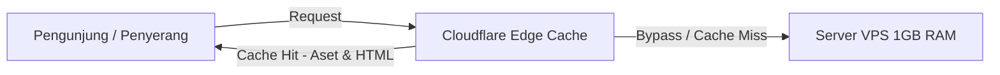

# Analisis & Panduan Mitigasi DDoS untuk Server Low-Spec (1GB RAM, 1 Core CPU)

Dokumen ini menganalisis risiko dan memberikan panduan mitigasi taktis untuk mengamankan halaman publik Sistem Manajemen Administrasi BEM dari serangan DDoS (Distributed Denial of Service) dalam kondisi spesifikasi server terbatas dan **tanpa menggunakan Object Storage**.

---

## 1. Analisis Dampak DDoS pada Server Low-Spec

Dengan spesifikasi **RAM 1GB, CPU 1 Core, dan Storage 20GB**, server Anda sangat rentan terhadap kegagalan sistem total (*crash*) saat menerima lonjakan lalu lintas (baik normal maupun serangan). Berikut adalah titik kritis yang akan terjadi:

| Komponen | Dampak saat Serangan DDoS | Akibat Akhir |
| :--- | :--- | :--- |
| **CPU (1 Core)** | PHP-FPM dan Database (MySQL/Postgres) berebut siklus CPU untuk memproses skrip dinamis dan kueri database pada setiap request. CPU akan cepat mencapai 100%. | Server menjadi tidak responsif (*hanging*), koneksi *time out* (Error 504). |
| **RAM (1GB)** | Setiap proses PHP-FPM memakan sekitar 20MB–40MB RAM. Jika ada 30 request masuk bersamaan dan memicu 30 proses worker, RAM akan habis. | Sistem Operasi akan memicu **OOM (Out-of-Memory) Killer** yang biasanya mematikan proses database (MySQL/PostgreSQL) atau PHP-FPM secara paksa. |
| **Storage (Tanpa Object Storage)** | Aset gambar (berita, logo, tanda tangan) dibaca langsung dari disk lokal (I/O disk). | Kecepatan baca disk menurun drastis, memacetkan proses antrean web server. Bandwidth VPS akan habis tersedot untuk transfer file gambar berulang kali. |

---

## 2. Strategi Solusi Tanpa Biaya Tambahan ($0)

Meskipun server memiliki keterbatasan fisik, kita bisa mengamankannya dengan arsitektur **Edge Caching** dan **Resource Limiting** tanpa perlu membayar biaya tambahan.

### Solusi Utama: Integrasi Cloudflare (Sangat Direkomendasikan)
Cloudflare (Free Tier) adalah benteng pertahanan terbaik dan paling efisien untuk skenario ini. Cloudflare akan bertindak sebagai **Reverse Proxy** di depan server Anda.



#### A. Caching Aset Statis di Cloudflare (Solusi Tanpa Object Storage)
Karena Anda tidak menggunakan Object Storage, file gambar di folder `/uploads/` dan `/assets/` akan menyedot bandwidth dan I/O disk VPS Anda.
* **Cara Kerja**: Ketika ada request ke `/uploads/berita/gambar.webp`, Cloudflare akan mengambilnya sekali dari server Anda (*Origin*), lalu menyimpannya di ribuan server edge mereka di seluruh dunia.
* **Manfaat**: Request berikutnya untuk gambar tersebut tidak akan pernah menyentuh VPS Anda. Ini menghemat penggunaan disk dan bandwidth VPS hingga **>90%**, menyamai fungsionalitas utama Object Storage secara gratis untuk sisi pembacaan (*read access*).

#### B. Caching Halaman HTML Publik ("Cache Everything")
Halaman publik seperti `index.php`, `berita.php`, dan `berita-detail.php` bersifat dinamis (mengambil data dari database), tetapi jarang berubah setiap detik. Kita bisa memanfaatkan Cloudflare untuk meng-cache seluruh halaman HTML ini menjadi statis.
* **Langkah Konfigurasi**:
  1. Masuk ke Dashboard Cloudflare Anda.
  2. Buka menu **Rules** > **Page Rules** atau **Cache Rules**.
  3. Buat aturan baru untuk halaman publik:
     * **URL Match**: `https://domain-anda.com/` (Homepage) dan `https://domain-anda.com/berita-detail.php*`
     * **Setting**: `Cache Level` = `Cache Everything`
     * **Edge Cache TTL**: Tentukan durasi (misal: 1 jam atau 2 jam).
  4. **PENTING: Bypass Admin Panel**. Buat Page Rule dengan prioritas lebih tinggi untuk halaman admin agar tidak ter-cache oleh Cloudflare:
     * **URL Match**: `https://domain-anda.com/admin/*`
     * **Setting**: `Cache Level` = `Bypass` (atau matikan caching).

> [!TIP]
> Dengan mengaktifkan **Cache Everything** untuk halaman publik, ketika diserang DDoS pada halaman `berita-detail.php`, Cloudflare akan menyajikan halaman tersebut dari cache mereka. Database PostgreSQL/MySQL dan PHP-FPM di VPS Anda **tidak akan bekerja sama sekali** untuk melayani request publik tersebut.

---

## 3. Langkah Pengamanan di Sisi Server (Origin Server)

Untuk mengantisipasi penyerang yang mencoba mem-bypass Cloudflare (mengakses IP VPS langsung), kita harus memperkuat konfigurasi Nginx, PHP-FPM, dan Database di dalam VPS.

### A. Konfigurasi Nginx Rate Limiting
Tambahkan pembatasan jumlah request per IP untuk mencegah *abuse* langsung ke server. Edit konfigurasi Nginx Anda (`/etc/nginx/nginx.conf` or server block terkait):

```nginx
# Mendefinisikan zona pembatasan di blok 'http'
limit_req_zone $binary_remote_addr zone=public_limit:10m rate=5r/s;
limit_req_zone $binary_remote_addr zone=admin_limit:10m rate=1r/s;

server {
    # ...
    
    # Terapkan rate limit pada file PHP publik
    location ~ \.php$ {
        limit_req zone=public_limit burst=10 nodelay;
        
        fastcgi_pass unix:/var/run/php/php8.1-fpm.sock;
        # ... konfigurasi fastcgi lainnya ...
    }
    
    # Batasi area login admin secara lebih ketat untuk mencegah brute-force/DDoS
    location /admin/login.php {
        limit_req zone=admin_limit burst=3 nodelay;
        
        fastcgi_pass unix:/var/run/php/php8.1-fpm.sock;
        # ...
    }
}
```

> [!NOTE]
> * **`rate=5r/s`**: Membatasi rata-rata request sebanyak 5 request per detik per IP.
> * **`burst=10`**: Memperbolehkan antrean tambahan hingga 10 request sebelum Nginx mengembalikan error `503 Service Temporarily Unavailable` ke penyerang.

---

### B. Tuning PHP-FPM (Mencegah OOM Crash)
Konfigurasi default PHP-FPM biasanya mengizinkan pembuatan worker hingga 20-50 proses. Pada RAM 1GB, hal ini dijamin akan menyebabkan *crash* akibat kehabisan memori.
Edit berkas konfigurasi pool PHP-FPM (biasanya di `/etc/php/8.x/fpm/pool.d/www.conf`):

```ini
; Menggunakan mode ondemand atau dynamic dengan batas ketat
pm = ondemand

; Maksimum worker PHP-FPM yang boleh aktif bersamaan
; Rumus kasar untuk RAM 1GB: (Sisa RAM Bebas / 40MB per PHP worker)
; Jika OS + DB memakai 600MB, sisa RAM 400MB. 400MB / 40MB = 10 worker.
; Setel aman di angka 5-8 worker.
pm.max_children = 6

; Waktu tunggu mematikan worker yang menganggur
pm.process_idle_timeout = 10s

; Batasi jumlah request per worker sebelum di-restart secara otomatis
; Berguna untuk mencegah memory leak pada skrip PHP
pm.max_requests = 500
```

---

### C. Hanya Izinkan Lalu Lintas dari Cloudflare (UFW/Firewall)
Untuk mencegah penyerang menembak IP publik VPS Anda secara langsung (membypass proteksi Cloudflare), konfigurasikan firewall (UFW) di VPS agar **hanya menerima koneksi HTTP/HTTPS (port 80 dan 443) yang berasal dari IP resmi Cloudflare**.

Anda dapat mengotomatiskan ini dengan skrip shell sederhana untuk mengambil IP Cloudflare terbaru dan mendaftarkannya ke UFW:

```bash
# Hapus semua aturan port 80 & 443 sebelumnya
ufw delete allow 80/tcp
ufw delete allow 443/tcp

# Izinkan akses port 80 & 443 HANYA dari IP range Cloudflare
for ip in $(curl -s https://www.cloudflare.com/ips-v4); do
    ufw allow from $ip to any port 80 proto tcp
    ufw allow from $ip to any port 443 proto tcp
done

for ip in $(curl -s https://www.cloudflare.com/ips-v6); do
    ufw allow from $ip to any port 80 proto tcp
    ufw allow from $ip to any port 443 proto tcp
done

# Aktifkan UFW
ufw reload
```

---

## 4. Optimasi Sisi Aplikasi (PHP Code Optimization)

Jika Anda tidak dapat menggunakan Cloudflare (misalnya karena kebijakan kampus/domain lokal yang tidak bisa dipindahkan DNS-nya ke Cloudflare), Anda wajib menerapkan **Application Static Caching** secara lokal di PHP.

### Implementasi Static File Caching Sederhana di PHP
Untuk halaman yang memakan resource query database besar (seperti detail berita), buat skrip caching berbasis berkas di server lokal.

Contoh konsep implementasi pada `berita-detail.php`:

```php
<?php
// Tentukan path cache file berdasarkan parameter ID berita
$berita_id = isset($_GET['id']) ? intval($_GET['id']) : 0;
$cache_file = __DIR__ . "/scratch/cache/berita_detail_" . $berita_id . ".html";
$cache_time = 1800; // Durasi cache aktif (1800 detik = 30 menit)

// 1. Cek apakah cache statis masih valid
if (file_exists($cache_file) && (time() - filemtime($cache_file) < $cache_time)) {
    // Jika valid, langsung tampilkan file HTML statis dan hentikan eksekusi
    include($cache_file);
    exit;
}

// 2. Jika cache kedaluwarsa atau belum ada, nyalakan output buffering
ob_start();

// ... SCRIPT PHP & KUERI DATABASE ANDA SEPERTI BIASA ...
// ... (Kueri SELECT ke database, pembuatan HTML halaman berita-detail.php) ...

// Ambil output HTML yang dihasilkan
$html_content = ob_get_contents();
ob_end_flush();

// 3. Simpan output HTML ke file cache untuk request berikutnya
if ($berita_id > 0) {
    if (!is_dir(__DIR__ . "/scratch/cache")) {
        mkdir(__DIR__ . "/scratch/cache", 0755, true);
    }
    file_put_contents($cache_file, $html_content);
}
?>
```

* **Keuntungan**: Query database hanya dieksekusi **sekali setiap 30 menit** per berita. Serangan DDoS yang berulang kali memanggil `berita-detail.php?id=5` hanya akan melakukan operasi pembacaan file HTML statis dari disk lokal, alih-alih melakukan query database yang berat.

---

## Ringkasan Rencana Tindakan (Action Plan)

1. **Pasang Cloudflare** di depan domain web Anda (Langkah paling krusial, instan, gratis, dan efektif).
2. **Aktifkan Cache Everything** pada Cloudflare Page/Cache Rules untuk halaman publik (Homepage, detail berita, daftar berita).
3. **Konfigurasi UFW (Firewall)** di server agar hanya menerima koneksi port 80/443 dari IP Cloudflare untuk mencegah bypass.
4. **Tuning file `www.conf` PHP-FPM** Anda: ubah ke `pm = ondemand` dengan `pm.max_children = 6` agar RAM 1GB tidak jebol (*OOM Crash*).
5. **Terapkan Caching Sisi Aplikasi** jika integrasi DNS Cloudflare tidak memungkinkan.
