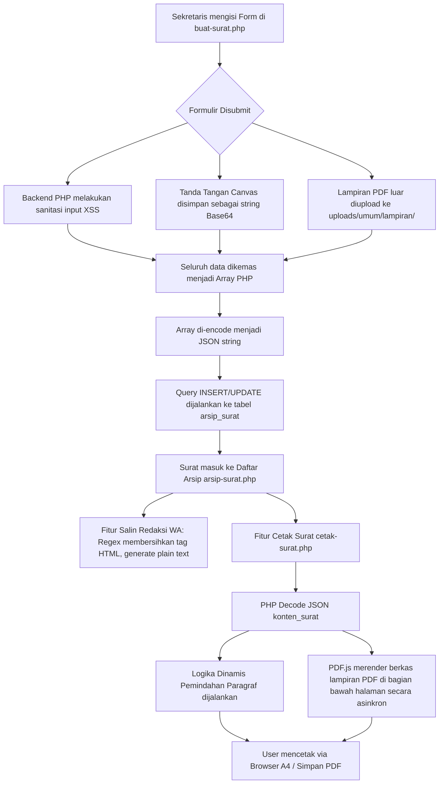

# DOKUMENTASI TEKNIS & ALUR KERJA SISTEM PERSURATAN BPM
## Sistem Manajemen Administrasi BPM (Astawidya)

Dokumen ini menjelaskan secara mendalam arsitektur teknis, alur data, skema database, dan logika pemrograman khusus yang menggerakkan **Modul Persuratan** pada Sistem BPM. Dokumen ini ditujukan bagi pengembang (*developer*) yang ingin memelihara atau memperluas fitur persuratan ini di masa depan.

---

### 1. Konsep Dasar & Arsitektur Penyimpanan

Sistem Persuratan Astawidya menggunakan pola desain **Hybrid NoSQL-on-SQL**. 

* **Kolom Relasional Terindeks (SQL):** Digunakan untuk data administratif yang sering dicari, difilter, atau diagregasi (seperti `id`, `periode_id`, `jenis_surat`, `nomor_surat`, `perihal`, dan `tanggal_dikirim`).
* **Kolom Skema-Bebas (JSON/NoSQL):** Seluruh isi detail formulir surat disimpan ke dalam satu kolom teks bernama **`konten_surat`** dalam format **JSON String**. 

#### Mengapa pendekatan ini dipilih?
1. **Skalabilitas Tanpa Batas:** Jika Anda ingin menambah kolom input baru di form (misal: "Nama Narasumber", "Jumlah Panitia"), Anda tidak perlu memodifikasi tabel database (`ALTER TABLE`). Cukup tambahkan input di HTML dan simpan di array JSON.
2. **Kueri Sangat Cepat:** Seluruh data surat termuat hanya dengan satu kueri database tunggal (`SELECT`), meningkatkan performa pemuatan halaman secara signifikan.

---

### 2. Diagram Alur Data (Data Flow Diagram)

Berikut adalah visualisasi alur pembuatan surat dari pengisian formulir hingga pencetakan dokumen PDF dan pembagian ke WhatsApp:



---

### 3. Penjelasan Alur Kerja Langkah-demi-Langkah

#### Langkah 1: Pengisian & Pengiriman Form (`buat-surat.php`)
1. **Sanitasi Input:** Semua input teks dibersihkan dari karakter berbahaya menggunakan helper `sanitizeText()` di `functions.php` untuk mencegah serangan SQL Injection dan XSS.
2. **Tanda Tangan Digital (Signature Pad):** Menggunakan pustaka JavaScript berbasis HTML5 Canvas. Lukisan tanda tangan diubah menjadi format data string **Base64 Data URI** (`data:image/png;base64,...`) lalu dikirim sebagai input teks tersembunyi (*hidden input*).
3. **Unggah Lampiran PDF:** Berkas PDF luar divalidasi (ekstensi harus `.pdf`). Berkas diganti namanya secara acak menggunakan `uniqid('lamp_', true)` untuk menghindari tabrakan nama file, kemudian dipindahkan ke folder `/uploads/umum/lampiran/`.

#### Langkah 2: Pemrosesan & Penyimpanan Database
1. PHP mengumpulkan semua data form ke dalam sebuah array asosiatif:
   ```php
   $konten_data = [
       'sapaan_tujuan' => $_POST['sapaan_tujuan'],
       'nama_kegiatan' => $_POST['nama_kegiatan'],
       'tema'          => $_POST['tema'],
       // ... data lainnya
       'lampiran_files'=> $lampiran_files // Menyimpan nama file pdf yang diupload
   ];
   ```
2. Array dikonversi menjadi teks string JSON:
   ```php
   $konten_json = json_encode($konten_data);
   ```
3. PHP mengeksekusi perintah SQL `INSERT` atau `UPDATE` untuk menyimpan data ke tabel `arsip_surat` di database (MySQL atau PostgreSQL).

#### Langkah 3: Pratampilan & Rendering Cetak (`cetak-surat.php`)
Saat tombol "Cetak" ditekan:
1. Aplikasi memuat berkas `/admin/cetak-surat.php` dengan menyertakan parameter ID surat (`?id=xx`).
2. PHP memuat baris surat dari database, lalu melakukan operasi decode JSON:
   ```php
   $konten = json_decode($surat['konten_surat'], true);
   ```
3. **Logika Otomatisasi Paragraf:** Sistem secara otomatis mendeteksi kata kunci perihal (seperti `"podcast"` atau `"pemberitahuan"`). Sistem memindahkan kata kunci tersebut dari paragraf penutup (agar tidak terjadi redudansi) ke paragraf pembuka secara dinamis demi menjaga tata bahasa Indonesia yang formal dan profesional.
4. **Rendering Lampiran PDF via PDF.js:**
   * Halaman cetak memuat pustaka **PDF.js v2.16.105** secara asinkron.
   * Berkas PDF luar dipanggil menggunakan path relatif aman: `../uploads/` + `nama_file`.
   * PDF.js membaca berkas PDF halaman demi halaman, merendernya ke elemen `<canvas>` HTML5, dan menyisipkannya langsung di bagian bawah halaman surat resmi BPM secara otomatis saat dokumen dicetak.

#### Langkah 4: Fitur Salin Redaksi WhatsApp (`arsip-surat.php`)
Saat sekretaris mengklik ikon WhatsApp untuk menyalin pesan:
1. JavaScript mengambil objek data surat lengkap (dalam bentuk JSON).
2. Teks di dalam bidang "Konteks" yang ditulis menggunakan *Mini Rich Text Editor* disanitasi menggunakan ekspresi reguler (Regex) untuk **menghapus seluruh tag HTML** (seperti `<span>`, `<div>`, dll.) dan sampah metadata editor (seperti `data-path-to-node`).
3. JavaScript merangkai pesan rapi lengkap dengan ornamen emoji jadwal, detail waktu, tempat pelaksanaan, dan link tanda tangan resmi BPM, lalu menyalinnya ke clipboard sistem pengguna.

---

### 4. Skema Lengkap JSON `konten_surat`

Di bawah ini adalah daftar kunci (*keys*) yang tersimpan di dalam JSON kolom `konten_surat` beserta tipe data dan kegunaannya:

| Kunci (*Key*) | Tipe Data | Kegunaan / Keterangan |
| :--- | :--- | :--- |
| `sapaan_tujuan` | `string` | Sapaan penerima (cth: "Bapak/Ibu", "Saudara/i"). |
| `nama_kegiatan` | `string` | Nama kegiatan utama BPM (cth: "BPM CUP 2026"). |
| `tema` | `string` | Tema resmi kegiatan. |
| `pelaksanaan_hari_tanggal` | `string` | Hari & Tanggal acara (cth: "Sabtu, 30 Mei 2026"). |
| `pelaksanaan_waktu` | `string` | Waktu kegiatan (cth: "08.00 s.d Selesai"). |
| `pelaksanaan_tempat` | `string` | Lokasi fisik acara (cth: "Gedung Serbaguna"). |
| `konteks` | `string` | Paragraf isi surat dinamis (ditulis via editor). |
| `panitia_ketua` | `string` | Nama Ketua Panitia (jika ada). |
| `panitia_sekretaris` | `string` | Nama Sekretaris Panitia (jika ada). |
| `panitia_ketua_ttd` | `string` | TTD Ketua Panitia (Format: Base64 String gambar). |
| `panitia_sekretaris_ttd` | `string` | TTD Sekretaris Panitia (Format: Base64 String gambar). |
| `use_ttd_warek` | `string/int` | Flag boolean (`"1"` atau `"0"`) untuk menampilkan TTD Warek III. |
| `use_ttd_presma` | `string/int` | Flag boolean (`"1"` atau `"0"`) untuk menampilkan TTD Presiden Mahasiswa. |
| `lampiran_files` | `array` | Daftar nama berkas PDF luar yang diunggah. |
| `lampiran_internal_ids` | `array` | Daftar ID tabel `barang_master` yang dipinjam secara resmi. |
| `rundown_internal_ids` | `array` | Daftar ID Rundown acara internal BPM yang terhubung. |

---

### 5. Kode Kunci & Logika Algoritma

#### A. Algoritma Pemindah Paragraf Dinamis (`cetak-surat.php`)
Logika ini memastikan kata kunci perihal dipindahkan ke paragraf pertama dan dibersihkan dari paragraf kedua:
```php
// Ambil perihal & ubah ke lowercase untuk pencarian keyword
$perihal_lc = strtolower($surat['perihal'] ?? '');

// Deteksi varian kata kunci
$is_podcast = (strpos($perihal_lc, 'podcast') !== false || strpos($perihal_lc, 'poadcast') !== false);
$is_pemberitahuan = (strpos($perihal_lc, 'pemberitahuan') !== false);

// 1. Tentukan Kata Utama Paragraf Pertama
$keyword_paragraf_1 = "";
if ($is_podcast) {
    $keyword_paragraf_1 = "podcast ";
} elseif ($is_pemberitahuan) {
    $keyword_paragraf_1 = "pemberitahuan ";
}

// 2. Buat Paragraf Pembuka Dinamis
$paragraf_1 = "Dengan ini kami menyampaikan undangan {$keyword_paragraf_1}kepada {$sasaran_nama} agar dapat menghadiri kegiatan tersebut.";

// 3. Buat Paragraf Penutup Dinamis (Membersihkan keyword ganda)
$paragraf_2 = "Demikian surat undangan ini kami sampaikan, atas perhatian dan kerjasamanya kami ucapkan terimakasih.";
```

#### B. Pembersihan HTML untuk Clipboard WA (`arsip-surat.php`)
Pembersihan teks kaya dari Rich Text Editor sebelum disalin ke Clipboard:
```javascript
function cleanHtmlForWA(htmlString) {
    if (!htmlString) return "";
    
    // 1. Buat elemen DOM bayangan untuk parse HTML
    const tempDiv = document.createElement("div");
    tempDiv.innerHTML = htmlString;
    
    // 2. Ekstrak teks bersih
    let text = tempDiv.textContent || tempDiv.innerText || "";
    
    // 3. Bersihkan sampah tag dan spasi berlebih dengan regex
    text = text.replace(/<[^>]*>/g, ""); // Hapus tag sisa
    text = text.replace(/\s+/g, " ").trim(); // Satukan spasi berlebih
    
    return text;
}
```

---

Dengan memahami arsitektur di atas, pengembangan dan penambahan format surat baru di dalam **Sistem BPM (Astawidya)** dapat diselesaikan dengan cepat, aman, dan tanpa mengganggu stabilitas data yang sudah ada!
